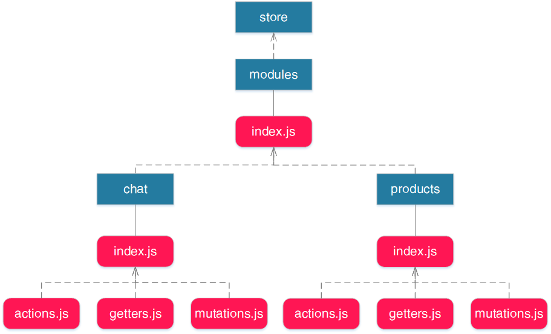
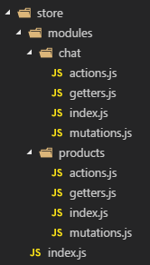

# vuex-namespaced-module-structure by <a href="https://github.com/igeligel">igeligel</a>

> A Vue.js/Vuex project showcasing a little bit more complex store structure.
> This project was created in cooperation with
> [3YOURMIND](https://github.com/3YOURMIND).

<a href="./License.md"></a>
<a href="https://github.com/igeligel/vuex-namespaced-module-structure/pulls"></a>
<a href="https://www.3yourmind.com/career"></a>
<a href="https://github.com/igeligel/vuex-namespaced-module-structure/stargazers"></a>

## Showcase/Architecture

A namespaced module based Vuex store structure.

<p><details>
  <summary><b>diagram</b></summary>
  <p></p>
</details></p>

<p><details>
  <summary><b>file structure</b></summary>
  
</details></p>

## Dependencies

<p><details>
  <summary><b>npm dependencies</b></summary>

| Dependency | Version |
| ---------- | ------- |
| vue        | ^2.5.2  |
| vue-router | ^3.0.1  |
| vuex       | ^3.0.0  |

</details></p>

## Installation

The installation process is split into two sections for
[development](#development) and [production](#production) use. You can find a
production version of this site live at
[vuex-namespaced-module-structure.netlify.com](https://vuex-namespaced-module-structure.netlify.com).

### Development

<p><details>
  <summary><b>instructions</b></summary>

#### Using npm

```shell
npm install
npm run dev
```

#### Using yarn

```shell
yarn install
yarn run dev
```

</details></p>

### Production

<p><details>
  <summary><b>instructions</b></summary>

#### Using npm

```shell
npm install
npm run build
```

#### Using yarn

```shell
yarn install
yarn run build
```

</details></p>

## Examples

* [bstavroulakis/vue-wordpress-pwa](https://github.com/bstavroulakis/vue-wordpress-pwa)
* [igeligel/vuex-namespaced-module-structure](https://github.com/igeligel/vuex-namespaced-module-structure)

## Contact

<a href="https://twitter.com/kevinpeters_"></a>

## Contributors

<table><thead><tr><th align="center"><a href="https://github.com/igeligel"><br><sub>igeligel</sub></a><br><p>Contributions: 18</p></th></tbody></table>

## License

_vuex-namespaced-module-structure_ is realeased under the
[MIT License](/License.md).
